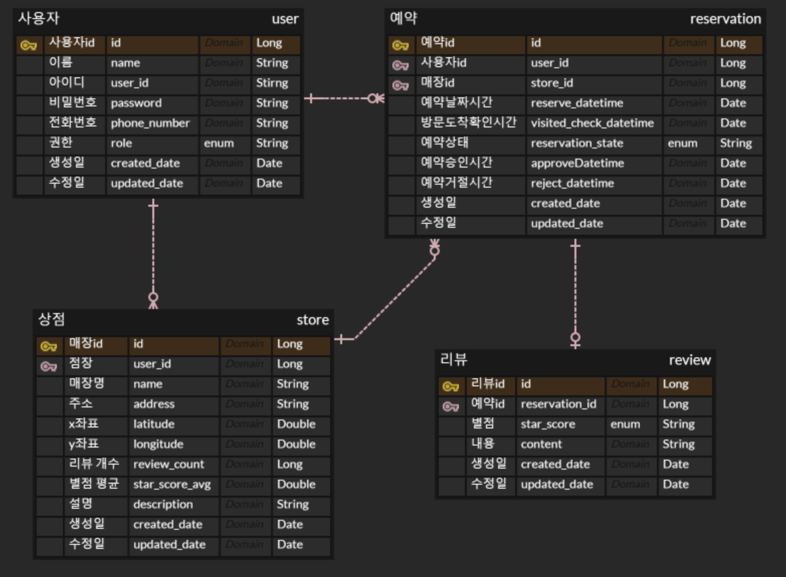

# 매장 예약 시스템

## 기능

1. 회원
   - 일반회원으로 회원가입을 할 수 있다.
   - 파트너로 회원가입을 할 수 있다.
2. 매장
   - 파트너는 매장을 등록/수정/삭제할 수 있다.
   - 일반회원은 매장을 조회/검색할 수 있다.
3. 예약
   - 일반회원은 조회한 매장을 예약할 수 있다.
   - 매장 매니저는 일반회원이 예약한 내역을 승인/거절 할 수 있다.
4. 리뷰
   - 예약을 이용한 일반 회원는 리뷰를 작성할 수 있다.
   - 리뷰를 작성한 회원은 리뷰를 수정/삭제할 수 있다.
   - 리뷰를 쓴 매장의 매니저는 매장에 대한 리뷰를 삭제할 수 있다.

## 외부 라이브러리

- io.jsonwebtoken:jjwt
  - 버전: 0.12.5
  - 목적: jwt 토큰 생성 및 처리
- com.mysql:mysql-connector-j
  - 목적: MySQL 데이터베이스와 Java를 연결
- org.projectlombok:lombok
  - 목적: Java 코드 간결성

## ERD
